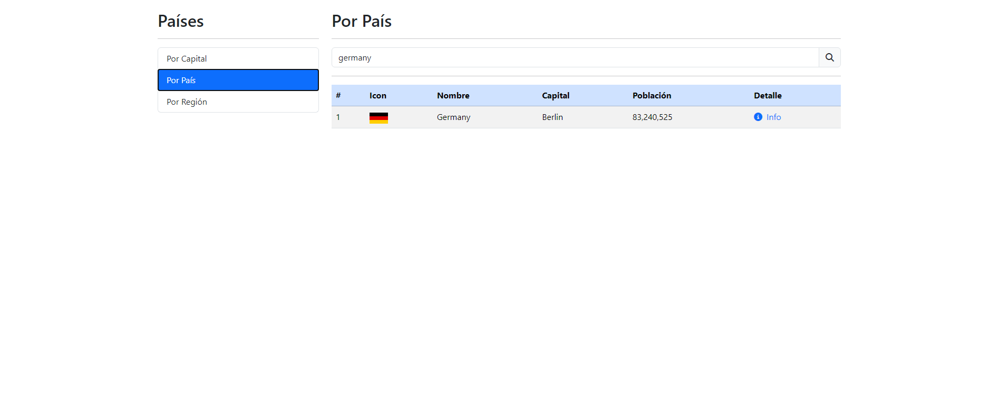
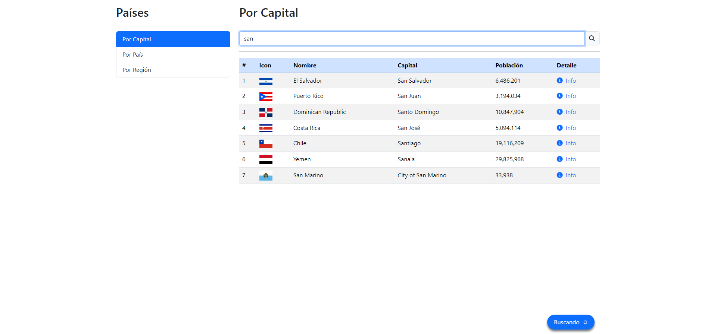
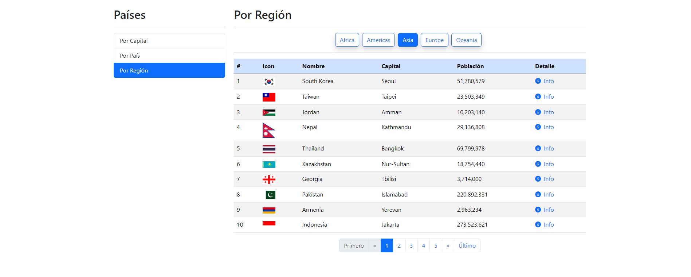
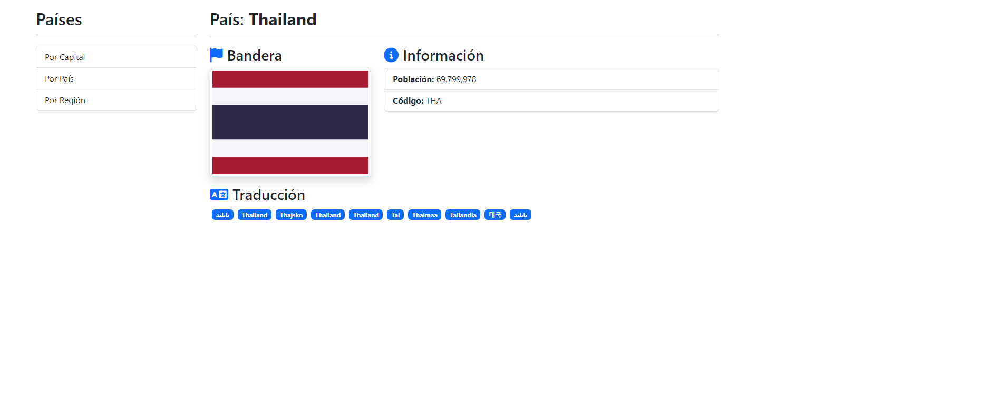

# 游깵 Aplicaci칩n de B칰squeda de Pa칤ses en Angular 15.2.0

## 游�� Caracter칤sticas

Esta es una aplicaci칩n desarrollada en Angular que permite buscar informaci칩n detallada de pa칤ses a trav칠s de la API p칰blica de [Rest Countries](https://restcountries.com/).  
Los usuarios pueden **buscar por nombre**, **buscar por capital**, **filtrar por regi칩n**, y **navegar hacia p치ginas individuales** con informaci칩n detallada de cada pa칤s.  
Adem치s, se ha implementado **paginaci칩n** para mejorar la navegaci칩n y **FontAwesome** para iconos interactivos.

---

### 游�� Tecnolog칤as utilizadas
- **Angular 15.2.0**
- **Rest Countries API** para la informaci칩n de pa칤ses
- **Angular Router** para la navegaci칩n SPA  
- **Lazy Loading** para optimizaci칩n de recursos  
- **FontAwesome** para iconos  
- **Netlify** para el despliegue  

---

## 游둰勇?Interfaces

### B칰squeda por pa칤s
  
Permite buscar un pa칤s espec칤fico escribiendo su nombre completo o parcial.

---

### B칰squeda por capital
  
Permite buscar pa칤ses escribiendo el nombre de su capital.

---

### B칰squeda por regi칩n
  
Filtra los resultados por regi칩n geogr치fica, como Europa, Asia, Am칠rica, etc.

---

### Detalle del pa칤s
  
Muestra informaci칩n detallada de un pa칤s.

---

### 游댕 Enlace a la App Desplegada
俱뫮잺 [Ver la aplicaci칩n en Netlify](https://countries-application-angular.netlify.app/)

---

### 游닟 Demo en YouTube
Mira el funcionamiento de la aplicaci칩n en este video:  
[![Demo en YouTube] (https://www.youtube.com/watch?v=QSTm5xKzQkk)  

---

## 游닍 Instalaci칩n y uso

1. **Clona este repositorio**:
   ```bash
   git clone https://github.com/PagarciaSima/Angular-Countries-App
   cd Angular-Countries-App
